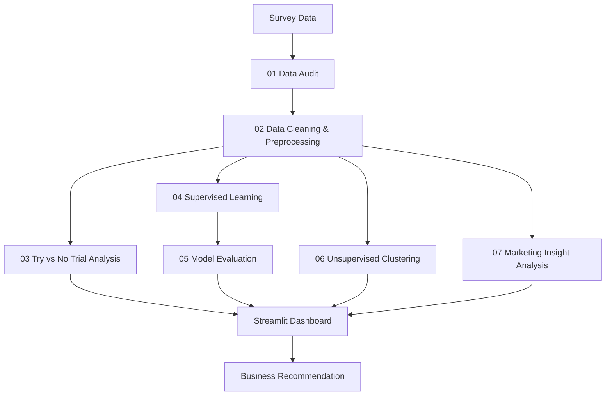

# Coffee RTD Consumer Insight Dashboard & ML Pipeline

โปรเจคนี้ใช้ข้อมูลแบบสอบถามเกี่ยวกับกาแฟพร้อมดื่ม (RTD) เพื่อวิเคราะห์พฤติกรรมการลองสินค้า แบ่งกลุ่มลูกค้า และสรุปข้อเสนอแนะเบื้องต้นสำหรับการสื่อสารทางการตลาด

เป้าหมายของเว็บไม่ใช่แบบทดสอบสำหรับลูกค้าทั่วไป แต่เป็น dashboard สำหรับสรุปผลวิเคราะห์จากข้อมูลแบบสอบถามและผลโมเดลในโปรเจค

## Workflow



## Main Project Sections

1. **Dataset / Data Collection**  
   ใช้ข้อมูลแบบสอบถามผู้บริโภคกาแฟ RTD โดยมีข้อมูลที่ใช้สรุปภาพรวม 181 แถว และชุดข้อมูลสำหรับโมเดล 118 แถว

2. **Data Cleaning & Preprocessing**  
   ทำความสะอาดข้อมูล แปลงข้อมูล categorical เป็น one-hot encoding แปลงช่วงอายุ/รายได้เป็น ordinal และเตรียมชุดข้อมูลสำหรับ supervised และ unsupervised learning

3. **EDA / Try vs No Trial Analysis**  
   วิเคราะห์ความแตกต่างระหว่างกลุ่ม Trial และ No Trial เช่น รายได้ เหตุผลที่อยากลอง ปัจจัยสินค้า ช่องทางสื่อ และช่องทางซื้อสินค้า

4. **Supervised Learning**  
   เปรียบเทียบโมเดล Logistic Regression, KNN, Decision Tree และ Random Forest โดยเลือกโมเดลจาก F1-score เป็นหลัก เนื่องจากข้อมูล Trial / No Trial ไม่สมดุล

5. **Unsupervised Learning**  
   ใช้ K-Means เพื่อแบ่งลูกค้าเป็น 4 clusters และนำผล Trial / No Trial กลับมาประกอบการแปลผลของแต่ละกลุ่ม

6. **Dashboard & Business Insight**  
   ใช้ Streamlit แสดงภาพรวมข้อมูล ผล supervised model ผล segmentation และข้อเสนอแนะทางการตลาดจาก evidence ในข้อมูลจริง

## File Structure

- `scripts/01_data_audit.py`: ตรวจสอบโครงสร้างข้อมูลและ missing values
- `scripts/02_preprocessing_common.py`: เตรียมข้อมูลสำหรับการวิเคราะห์และ machine learning
- `scripts/03_try_not_try_analysis.py`: วิเคราะห์ Try vs No Trial และสร้างกราฟ EDA
- `scripts/04_supervised_train_compare.py`: ฝึกและเปรียบเทียบโมเดล supervised learning
- `scripts/05_supervised_evaluate.py`: ประเมินโมเดลและสร้าง output สำหรับอธิบายผล
- `scripts/06_unsupervised_clustering.py`: แบ่งกลุ่มลูกค้าด้วย K-Means และ export cluster profile
- `scripts/07_brief_alignment_analysis.py`: วิเคราะห์ช่องทางสื่อ/ช่องทางซื้อและสรุป insight ทางการตลาด
- `app/streamlit_app.py`: Coffee RTD Consumer Insight Dashboard

## Dashboard Tabs

- **Overview**: สรุปจำนวนข้อมูล Trial / No Trial, data flow, EDA charts และคำตอบเบื้องต้นจากข้อมูล
- **โปรไฟล์กลุ่มลูกค้า**: เลือกดูโปรไฟล์จริงของแต่ละ cluster พร้อมจำนวนคน Try Rate ปัจจัยเด่น และแนวโน้มจากโมเดลของกลุ่มนั้น
- **Segment Match**: แสดงภาพรวม segmentation, Try Rate by Cluster, PCA plot, heatmap และข้อมูลประกอบการเลือก K
- **Business Recommendation**: สรุป evidence และข้อเสนอแนะเบื้องต้นสำหรับ target group, message, channel และ activation

## How to Run

รันคำสั่งจากโฟลเดอร์ `coffee-rtd-ml-project`

```bash
pip install -r requirements.txt
```

รัน pipeline:

```bash
python scripts/01_data_audit.py
python scripts/02_preprocessing_common.py
python scripts/03_try_not_try_analysis.py
python scripts/04_supervised_train_compare.py
python scripts/05_supervised_evaluate.py
python scripts/06_unsupervised_clustering.py
python scripts/07_brief_alignment_analysis.py
```

รัน dashboard:

```bash
streamlit run app/streamlit_app.py
```

## Key Findings

- **Trial / No Trial:** ชุดข้อมูลสำหรับโมเดลมี Trial 92 คน และ No Trial 26 คน
- **Trial Driver:** การแจกชิม / ทดลองสินค้า เป็นปัจจัยสำคัญที่ช่วยกระตุ้นการลองสินค้า
- **Income Insight:** กลุ่มรายได้ 20,000-29,999 บาท เป็นกลุ่มที่น่าสนใจในข้อมูลชุดนี้
- **Segmentation:** Cluster 2 มี Try Rate สูงที่สุด 91.7% แต่มีจำนวนตัวอย่าง 12 คน จึงควรตีความเป็นกลุ่มศักยภาพเบื้องต้น
- **Cluster 2 Profile:** ให้ความสำคัญกับกลิ่นหอมกาแฟ คนใกล้ตัว และแพ็กเกจ / ขวดสวย
- **Channel / Touchpoint:** สื่อสังคมออนไลน์เหมาะกับการสร้างการรับรู้ ส่วนร้านสะดวกซื้อเหมาะเป็นจุดกระตุ้นการซื้อ

## Technical Notes

- Supervised model ใช้สำหรับประเมินแนวโน้ม Trial / No Trial จากข้อมูลแบบสอบถาม ไม่ใช่การฟันธงลูกค้ารายบุคคล
- KNN ถูกปรับด้วย GridSearchCV และใช้ F1-score เป็นเกณฑ์หลักในการเปรียบเทียบ
- หน้า dashboard ใช้ข้อมูลจริงจาก survey, EDA output, model output และ cluster profile เป็นหลัก
- ส่วนทดลองปรับค่า persona ในเว็บเป็น optional และไม่ถูกใช้เป็นหลักฐานใน Business Recommendation
- ข้อเสนอแนะในโปรเจคนี้เป็นการวิเคราะห์เบื้องต้นจากข้อมูลแบบสอบถาม หากนำไปใช้จริงควรเก็บข้อมูลเพิ่มและทดลองแคมเปญจริงก่อนตัดสินใจ
