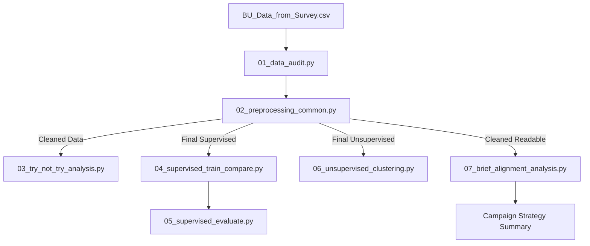

# ☕ Coffee RTD Market Entry ML Pipeline (Case 3 Alignment)

โปรเจควิเคราะห์พฤติกรรมผู้บริโภคและทำนายแนวโน้มการลองกาแฟพร้อมดื่ม (RTD) เพื่อสนับสนุนการวางแผนกลยุทธ์การตลาด โดยเน้นความถูกต้องทางวิชาการและการอธิบายผลลัพธ์อย่างเหมาะสมกับข้อมูลแบบสอบถาม

## 📊 Workflow Diagram


## 🚀 โครงสร้างไฟล์ที่ใช้ส่งงาน (Pipeline Scripts)
- `01_data_audit.py`: ตรวจสอบความสมบูรณ์และโครงสร้างข้อมูล
- `02_preprocessing_common.py`: รองรับโครงสร้างแบบสอบถามและค้นหาคอลัมน์อัตโนมัติ
- `03_try_not_try_analysis.py`: วิเคราะห์พฤติกรรมการลอง (Try vs No Trial EDA)
- `04_supervised_train_compare.py`: เปรียบเทียบและฝึกสอนโมเดลทำนาย
- `05_supervised_evaluate.py`: ประเมินผลโมเดลและสรุปประสิทธิภาพ (XAI)
- `06_unsupervised_clustering.py`: แบ่งกลุ่มลูกค้าเป้าหมาย (Customer Segmentation)
- `07_brief_alignment_analysis.py`: วิเคราะห์สื่อและช่องทางเพื่อวางแผนแคมเปญ
- `app/streamlit_app.py`: เว็บแอปพลิเคชันต้นแบบสำหรับสาธิตการทำนาย (Prototype Demo)

## 🛠️ วิธีรันโปรเจค
รันคำสั่งจากโฟลเดอร์ `coffee-rtd-ml-project`

```bash
python scripts/01_data_audit.py
python scripts/02_preprocessing_common.py
python scripts/03_try_not_try_analysis.py
python scripts/04_supervised_train_compare.py
python scripts/05_supervised_evaluate.py
python scripts/06_unsupervised_clustering.py
python scripts/07_brief_alignment_analysis.py
```

รัน Streamlit prototype:

```bash
streamlit run app/streamlit_app.py
```

## 💡 สรุปผลการค้นพบที่สำคัญ (Key Findings)
- **Trial Driver หลัก:** การใช้ **Product Sampling** (การแจกให้ชิม) เป็นปัจจัยสำคัญที่สุดที่กระตุ้นให้เกิดการลอง
- **กลุ่มเป้าหมายเชิงประชากร:** กลุ่มที่มีรายได้ **20,000–29,999 บาท** มีอัตราการลอง (Try Rate) สูงที่สุดในกลุ่มที่มีจำนวนตัวอย่างเพียงพอ
- **ปัจจัยดึงดูดใจ (Key Differentiator):** ผู้บริโภคสนใจเพราะมองว่า **"ประหยัดกว่ากินกาแฟสดตามร้าน"** แต่ยังต้องการคุณภาพที่ใกล้เคียงเดิม
- **ช่องทางสื่อหลัก (Media Channel):** **Social Media (โดยเฉพาะ Facebook)** เป็นช่องทางที่กลุ่มเป้าหมายพบเห็นสื่อมากที่สุด
- **จุดสัมผัสลูกค้า (Touchpoint):** **ร้านสะดวกซื้อ (7-11)** เป็นช่องทางการจัดจำหน่าย (Purchase / Sales Touchpoint) ที่สำคัญที่สุดในการเข้าถึงลูกค้า
- **กลุ่มศักยภาพสูง (Segmentation):** **Cluster 2** คือกลุ่ม "Best Segment" ที่มีความโน้มเอียงในการลองสินค้าใหม่สูงสุด (Try Rate 91.7%)

## 📊 หมายเหตุทางเทคนิค
- โมเดลวิเคราะห์เฉพาะผู้ที่ดื่มกาแฟเท่านั้น (`is_drinker_binary == 1`)
- โมเดลเหมาะกับการทำ **Positive Screening** (การค้นหากลุ่ม Trial) เพราะ Recall ของกลุ่ม Trial สูงใน test set
- ปัญหา Class Imbalance เป็นปัจจัยที่ทำให้การจำแนกกลุ่ม No Trial มีข้อจำกัด จึงไม่ควรสรุปว่าโมเดลแม่นยำเท่ากันทุกกลุ่ม
- Streamlit app เป็น prototype สำหรับการนำเสนอ ไม่ใช่ production system
