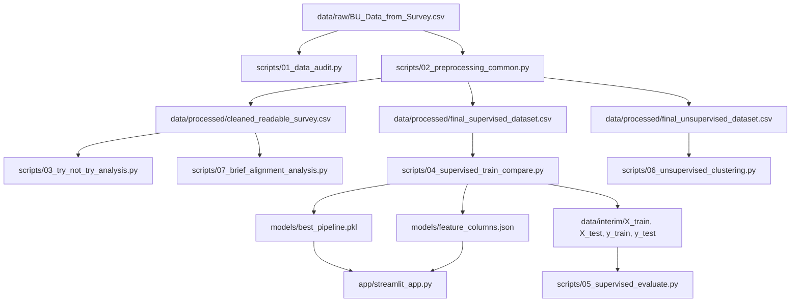

# Source Code Report: Coffee RTD ML Project

## 1. โครงสร้างโปรแกรมโดยรวม

โปรเจคนี้เป็น pipeline สำหรับวิเคราะห์ข้อมูลแบบสอบถาม Coffee Survey เพื่อประเมินแนวโน้มการลองกาแฟพร้อมดื่ม RTD แบรนด์ใหม่ โดยแบ่งงานออกเป็น 5 ส่วนหลัก:

- `data/raw/`: เก็บไฟล์แบบสอบถามต้นฉบับ
- `data/processed/`: เก็บ dataset ที่ผ่าน preprocessing แล้ว
- `data/interim/`: เก็บ train/test split สำหรับประเมินโมเดล
- `scripts/`: เก็บสคริปต์ pipeline ตั้งแต่ audit, preprocessing, EDA, supervised learning, unsupervised learning และ brief alignment
- `models/`: เก็บโมเดลและ feature list สำหรับ Streamlit prototype
- `outputs/`: เก็บรายงาน ตาราง และกราฟสำหรับนำไปใช้ทำสไลด์
- `app/`: เก็บ Streamlit web app prototype

## 2. Software Diagram / Workflow

## 3. คำอธิบายหน้าที่แต่ละไฟล์

- `scripts/01_data_audit.py`: ตรวจ row count, missing values, target raw counts และบันทึกคอลัมน์ที่เสี่ยง leakage
- `scripts/02_preprocessing_common.py`: โหลด raw survey, กรองเฉพาะผู้ดื่มกาแฟ, สร้าง `target_binary_trial`, ตัดฟีเจอร์ชา และสร้าง supervised/unsupervised dataset
- `scripts/03_try_not_try_analysis.py`: วิเคราะห์ Trial vs No Trial, สร้าง business insight และกราฟ EDA
- `scripts/04_supervised_train_compare.py`: แบ่ง train/test แบบ stratified, train หลายโมเดล, เปรียบเทียบ Accuracy/Precision/Recall/F1 และบันทึก best pipeline
- `scripts/05_supervised_evaluate.py`: โหลด test set และ best model เพื่อสร้าง confusion matrix, classification report และ decision tree explanation
- `scripts/06_unsupervised_clustering.py`: ทำ StandardScaler, K-Means clustering, PCA plot และสรุป cluster profile โดย merge target กลับมาหลัง clustering เพื่อดู Try Rate เท่านั้น
- `scripts/07_brief_alignment_analysis.py`: วิเคราะห์ media channel, purchase touchpoint และ influencer score ของกลุ่ม Trial เพื่อสร้าง campaign recommendation
- `app/streamlit_app.py`: Prototype demo สำหรับกรอกข้อมูลตัวอย่างและทำนาย Trial / No Trial ด้วยโมเดลที่บันทึกไว้

## 4. ขั้นตอนการทำงานของระบบหรือโมเดล

1. อ่านไฟล์แบบสอบถามจาก `data/raw/BU_Data_from_Survey.csv`
2. ตรวจสอบคุณภาพข้อมูลและ target distribution ด้วย `01_data_audit.py`
3. ทำ preprocessing ด้วย `02_preprocessing_common.py`
   - กรองเฉพาะผู้ที่ดื่มกาแฟ
   - สร้าง `target_binary_trial`
   - ตัดคอลัมน์เกี่ยวกับชาและคอลัมน์ที่เกี่ยวกับ target โดยตรง
   - สร้างไฟล์ supervised และ unsupervised dataset
4. วิเคราะห์ insight เบื้องต้นด้วย `03_try_not_try_analysis.py`
5. Train supervised models ด้วย `04_supervised_train_compare.py`
   - ใช้ `train_test_split(..., stratify=y)`
   - ใช้ pipeline พร้อม scaler สำหรับ Logistic Regression และ KNN
   - เลือกโมเดลจาก F1-score ของ test set
6. ประเมินโมเดลด้วย `05_supervised_evaluate.py`
   - ใช้ test set เท่านั้น
   - สร้าง confusion matrix และ classification report
   - ระบุข้อจำกัดเรื่อง class imbalance
7. ทำ unsupervised clustering ด้วย `06_unsupervised_clustering.py`
   - ไม่ใช้ target ตอน fit K-Means
   - scale features ก่อน clustering
   - เลือก K=4 เพื่อ business interpretability
   - merge target กลับมาหลัง clustering เพื่อดู Try Rate
8. วิเคราะห์ brief alignment ด้วย `07_brief_alignment_analysis.py`
   - Social Media / Facebook เป็น media channel หลัก
   - 7-11 เป็น purchase / sales touchpoint
   - Blogger/Reviewer เป็นช่องทางเสริมเมื่อคะแนนเฉลี่ยไม่สูงมาก
9. ใช้ `app/streamlit_app.py` เป็น prototype เพื่อสาธิตการทำนาย ไม่ใช่ production system

## ข้อจำกัดของงาน

- Dataset มี class imbalance โดยกลุ่ม Trial มีจำนวนมากกว่า No Trial
- โมเดลวิเคราะห์เฉพาะผู้ดื่มกาแฟ จึงไม่ควร generalize ไปยังคนที่ไม่ดื่มกาแฟ
- Streamlit app เป็น prototype สำหรับสาธิตแนวคิด ไม่ใช่ระบบ production
- K-Means เลือก K=4 เพื่อการตีความทางธุรกิจ แม้ค่า silhouette จะไม่ได้บอกว่า K=4 ดีที่สุด
